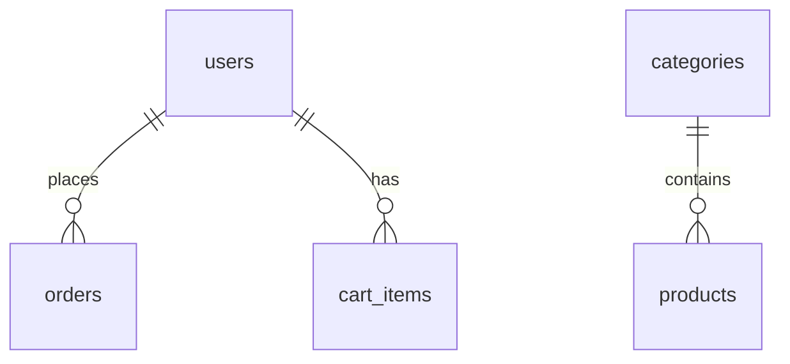

# ONA Closet: Ethnic and Festive Wear Store

A full-stack e-commerce website for ethnic and festive wear, with a customer storefront, online payments (test mode), and an admin panel.

**Live site:** (https://ecommerce-store-five-liart.vercel.app)
**API health check:** https://ona-closet-api.onrender.com/api/health
(The free hosting sleeps when idle, so the first load can take up to a minute.)

**Demo accounts**

- Customer: [email] / [password]
- Admin: available on request

**Test payment card (Razorpay test mode):** 4111 1111 1111 1111, any future expiry, any 3-digit CVV. No real money is charged.

## Features

**Customers**

- Register and log in (JWT authentication)
- Browse with search, filters (category, gender, occasion, fabric), sorting, and pagination
- Product pages with image gallery and size and colour variants with live stock
- Cart, address, and checkout with Razorpay test payments
- Order history, pay later, and cancel unpaid orders

**Admin**

- Role-based access (customer and admin)
- Add products with several images (Cloudinary uploads), variants, and categories
- Hide products, manage categories, and update order statuses

## Tech stack

| Layer    | Technology                                           |
| -------- | ---------------------------------------------------- |
| Frontend | React, Vite, React Router, Tailwind CSS, Axios       |
| Backend  | Node.js, Express                                     |
| Database | PostgreSQL (Neon)                                    |
| Auth     | JWT, bcrypt                                          |
| Images   | Cloudinary                                           |
| Payments | Razorpay (test mode)                                 |
| Hosting  | Vercel (frontend), Render (backend), Neon (database) |

## Highlights (what I'm proud of)

- **Safe checkout:** a database transaction with row locking prevents two customers buying the last item.
- **Price snapshots:** order items store the price paid, so later price changes never alter past orders.
- **Server-side trust:** prices, totals, user ids, and roles are always taken from the server, never from the browser.
- **Payment verification:** Razorpay's signature is verified on the server before an order is marked paid.
- **Security basics:** hashed passwords, parameterized SQL, rate-limited login, helmet headers, restricted CORS.
- **Design tokens:** colours and fonts are defined once, so the whole site can be restyled for a client in minutes.

## Database design

